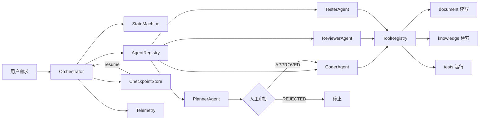

# multi-agent-pipeline

> 不依赖 Agent 框架、可独立运行的自研 Multi-Agent Orchestration 系统：
> 从零实现 Agent 运行时、状态机、Tool 权限、Human-in-the-loop、
> Checkpoint/Resume、遥测与 Evaluation，用于证明 Agent 工程原理理解与
> 工程化能力。

## 这个项目解决什么问题

单次 LLM 调用无法完成“规划 → 编码 → 审校 → 修复 → 测试”的复杂任务：

- 无法分步校验中间产物（计划是否合理、代码是否安全、测试是否覆盖）；
- 失败无法恢复（要么全部重跑，要么丢失上下文）；
- 无法回答“Agent 到底有没有用”（缺少可复现的评测）。

本项目用一个**自研轻量运行时**解决这些问题，并刻意不引入 LangGraph /
LangChain：编排、状态、工具、记忆、评测全部可控、可测试、可讲清原理。

## 核心能力

- **Agent 运行时**：`BaseAgent` / `AgentContext` / `AgentRegistry` /
  `AgentFactory`，角色即类，注册即扩展，无 if/elif 硬编码；
- **显式状态机**：plan → human_approval → code → review ⇄ fix → test →
  done，非法状态转移直接报错；
- **Tool 层 + 权限矩阵**：Agent 只能通过 `ToolRegistry` 访问资源，
  Planner 只读、Coder 可写代码文件、Tester 可运行测试；
- **Human-in-the-loop**：计划提交人工审批（APPROVED / REJECTED / EDITED），
  驳回立即停止；
- **可靠性**：LLM 调用指数退避重试、解析失败降级为人工处理、
  Checkpoint 按步骤落盘、失败可从断点续跑；
- **可观测性**：run_id / trace_id / 每步延迟 / token / 成本 / 重试 /
  工具调用；
- **评测**：`python -m evaluation.run` 输出 Task Success / Tool Accuracy /
  Latency / Tokens / Cost（mock 默认零成本，real 可切真实模型）。

## 架构



## Agent 工作流

```text
Planner
  ↓ 计划
Human Approval（APPROVED / REJECTED / EDITED）
  ↓
Coder（通过 Tool 写文件）
  ↓
Reviewer
  ↓ 通过？
  ├─ Yes → Tester → done
  └─ No  → Coder 修复 → Reviewer 复审（最多 3 轮，超限待人工）
```

串行依赖：规划 → 审批 → 编码 → 审校 → 测试。
可并行空间：多文件审校、多测试任务（当前版本单线程，接口已按工具隔离）。

## 快速开始

```bash
git clone <repo-url>
cd multi-agent-pipeline
python -m pip install -e ".[dev]"

# 运行完整流水线（Mock LLM，零成本）
python -m evaluation.run

# 真实模型（需要 OpenAI 兼容 API Key）
EVAL_MODE=real DEEPSEEK_API_KEY=sk-... python -m evaluation.run
```

也可以在代码中调用：

```python
import asyncio
from agent_pipeline.orchestrator import Orchestrator
from agent_pipeline.types import ApprovalDecision

async def main():
    result = await Orchestrator().run(
        "写一个 CSV 清洗工具",
        approve=lambda plan: ApprovalDecision(status="APPROVED"),
    )
    print(result.status, result.telemetry)

asyncio.run(main())
```

## 评测结果（mock 模式，真实运行数据）

```text
Task Success: 100% (6/6)
Tool Accuracy: 100%
Average Latency: <1 ms
Average Tokens: 391
Total Estimated Cost: 0
```

场景覆盖：完整流水线、提示词注入、歧义需求、工具滥用、人工驳回、
超时恢复（Checkpoint 续跑）。最新报告见
[evaluation/reports/report.md](evaluation/reports/report.md)。

## 安全设计

- 工具权限矩阵：任何 Agent 越权调用立即返回 `permission_denied`；
- 注入防护：需求中的“忽略指令”类文本由 Planner 记录并隔离，
  Reviewer 检出危险代码触发修复；
- 危险操作（rm -rf 等）进入代码产物即被审校拦截；
- Agent 不直接访问文件系统，全部走 Tool。

## 可靠性设计

- LLM 调用：指数退避重试（可配置次数与延迟）；
- 输出解析失败：重试 → 降级为人工处理（不静默吞错）；
- Checkpoint：plan / code / review / test 每个步骤落盘，`resume` 续跑；
- 状态机：非法转移直接抛错，防止流程失控。

## 测试与质量

```bash
pytest          # 78 个测试，覆盖率 ~90%
ruff check .    # PASS
mypy src        # PASS
python -m evaluation.run   # PASS（mock）
```

## 目录结构

```text
src/agent_pipeline/   Agent 运行时（agents / tools / state_machine /
                       checkpoint / telemetry / orchestrator / types）
evaluation/           评测数据集、runner、报告
prompts/              角色提示词（版本化）
tests/                单元与集成测试
docs/adr/             架构决策记录
```

## 文档

- [架构说明](docs/architecture.md)
- [评测策略](docs/evaluation.md)
- [ADR-001 Agent 运行时](docs/adr/ADR-001-agent-runtime.md)
- [ADR-002 评测策略](docs/adr/ADR-002-evaluation-strategy.md)

## License

MIT
